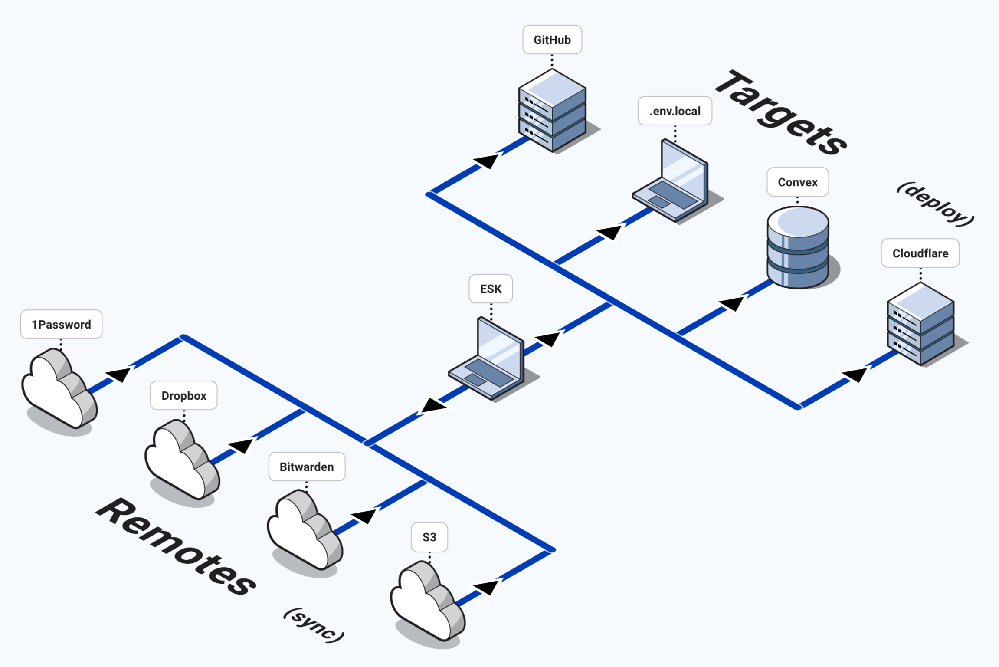

```
▄▖          ▗    ▌  ▄▖        ▗     ▖▖
▙▖▛▌▛▘▛▘▌▌▛▌▜▘█▌▛▌  ▚ █▌▛▘▛▘█▌▜▘▛▘  ▙▘█▌█▌▛▌█▌▛▘
▙▖▌▌▙▖▌ ▙▌▙▌▐▖▙▖▙▌  ▄▌▙▖▙▖▌ ▙▖▐▖▄▌  ▌▌▙▖▙▖▙▌▙▖▌
        ▄▌▌                               ▌
```

<div align="center">
  
</div>

**`ESK`** is an encrypted secrets manager that lets you define secrets once and deploy them to many targets.

It is built for teams that want:

- A local encrypted source of truth
- Simple deploys to local files and cloud platforms
- Optional sync/backup with shared secret backends

## What esk does

- Stores secrets in `.esk/store.enc` (AES-256-GCM encrypted)
- Keeps the decryption key in `.esk/store.key` (local only)
- Deploys to targets like `.env` files, Cloudflare, Convex, Vercel, GitHub Actions, Kubernetes, Docker Swarm, and more
- Syncs with remotes like 1Password, cloud folders, AWS Secrets Manager, Vault, Bitwarden, S3, GCP, Azure, Doppler, and SOPS
- Validates values against format, pattern, enum, and range constraints
- Audits required secrets before deploy — catches missing values early
- Detects empty/whitespace-only values that break runtime defaults
- Generates TypeScript declarations, runtime validators, and `.env.example` templates
- Prunes orphaned deploys (secrets removed from config but still deployed to targets)

## Install

**Shell script (Linux/macOS)**

```bash
curl -fsSL https://raw.githubusercontent.com/thomastheyoung/esk/main/install.sh | bash
```

**Cargo**

```bash
cargo install esk
cargo binstall esk
```

**From source**

```bash
git clone https://github.com/thomastheyoung/esk.git
cd esk
cargo build --release
```

## 60-second quick start

1. Initialize a project.

```bash
esk init
```

2. Add your first secret.

```bash
esk set API_KEY --env dev --group General
```

3. Add more secrets without syncing or deploying on each write, then deploy once.

```bash
esk set DATABASE_URL --env dev --group General --no-sync
esk deploy --env dev
```

4. Verify status.

```bash
esk list --env dev
esk status --env dev
```

`esk init` creates:

| File                     | Purpose                                                                  | Commit to git   |
| ------------------------ | ------------------------------------------------------------------------ | --------------- |
| `esk.yaml`               | Project config (environments, apps, targets, remotes, secrets, generate) | Yes             |
| `.esk/store.enc`         | Encrypted secret store                                                   | Yes             |
| `.esk/store.key`         | Local encryption key (32-byte hex)                                       | No              |
| `.esk/deploy-index.json` | Deploy state tracker                                                     | No (gitignored) |
| `.esk/sync-index.json`   | Sync state tracker                                                       | No (gitignored) |

## Mental model

`esk` has 3 parts:

1. **Store**: local encrypted data (`.esk/store.enc` + `.esk/store.key`)
2. **Targets**: deploy secrets to runtime services (`esk deploy`)
3. **Remotes**: sync full secret state to team/shared backends (`esk sync`)

## Important default behavior

By default, `esk set` and `esk delete` do more than update local storage:

1. Update encrypted local store
2. Push to configured remotes
3. Deploy to configured targets

Use `--no-sync` to skip steps 2 and 3. Use `--bail` to fail before deploy if any remote push fails.

## Minimal config (`esk.yaml`)

Start with local `.env` deploy only:

```yaml
project: myapp

environments: [dev, prod]

apps:
  web:
    path: .

targets:
  env:
    pattern: "{app_path}/.env{env_suffix}.local"
    env_suffix:
      dev: ""
      prod: ".production"

secrets:
  General:
    API_KEY:
      description: Example API key
      targets:
        env: [web:dev, web:prod]
```

When you need cloud deploy targets or shared sync, add target/remote blocks. See [TARGETS.md](TARGETS.md) and [REMOTES.md](REMOTES.md), or browse the [full example config](docs/esk.example.yaml) showcasing every available option.

## Commands you will use most

| Command                        | Purpose                                       |
| ------------------------------ | --------------------------------------------- |
| `esk init`                     | Initialize config and encrypted store         |
| `esk set <KEY> --env <ENV>`    | Set a secret (auto-sync/deploy by default)    |
| `esk get <KEY> --env <ENV>`    | Read a secret                                 |
| `esk delete <KEY> --env <ENV>` | Delete a secret (auto-sync/deploy by default) |
| `esk list [--env <ENV>]`       | List secrets and deploy status                |
| `esk deploy [--env <ENV>]`     | Deploy to configured targets                  |
| `esk status [--env <ENV>]`     | Show drift/sync dashboard                     |
| `esk sync [--env <ENV>]`       | Pull, reconcile, and push remote state        |
| `esk generate [<FORMAT>]`      | Generate code/config from secret definitions  |

Full flags and behavior: [API.md](API.md).

## Supported deploy targets

- `.env* files`
- `aws_ssm`
- `cloudflare`
- `convex`
- `docker`
- `fly`
- `github`
- `gitlab`
- `heroku`
- `kubernetes`
- `netlify`
- `railway`
- `supabase`
- `vercel`

Target config details: [TARGETS.md](TARGETS.md).

## Supported sync remotes

- `1password`
- `aws_secrets_manager`
- `azure`
- `bitwarden`
- Cloud storage (`dropbox`, `gdrive`, `onedrive`, etc.)
- `doppler`
- `gcp`
- `s3`
- `sops`
- `vault`

Remote config details: [REMOTES.md](REMOTES.md).

## Security model

- Encryption: AES-256-GCM with a random nonce for every write
- Key isolation: `.esk/store.key` stays local and must not be committed
- Tamper resistance: authenticated encryption
- Reliability: atomic writes for store and index files

The encrypted store file is safe to commit. The key file is not.

## Quick troubleshooting

- `esk.yaml not found`: run commands from your project root, or run `esk init`
- `encryption key not found`: run `esk init` to create `.esk/store.key`
- Target/remote CLI errors: install and authenticate required CLIs (for example `wrangler`, `op`, `aws`)
- Unknown environment/app in target: verify names match `environments` and `apps` in `esk.yaml`

## MCP server

esk includes an MCP (Model Context Protocol) server that exposes secret operations as structured tools over stdio. Any MCP-compatible client can use it — Claude Code, Claude Desktop, Cursor, Zed, etc.

**Build:**

```bash
cargo install esk --features mcp
# or from source
cargo build --release --features mcp
```

**Configure** (example for Claude Code `~/.claude/settings.json`):

```json
{
  "mcpServers": {
    "esk": {
      "command": "esk-mcp",
      "args": []
    }
  }
}
```

**Available tools:**

| Tool           | Description                                      |
| -------------- | ------------------------------------------------ |
| `esk_get`      | Retrieve a secret value                          |
| `esk_set`      | Set a secret value (no auto-deploy)              |
| `esk_delete`   | Delete a secret value (no auto-deploy)           |
| `esk_list`     | List secrets with deploy status per environment  |
| `esk_status`   | Project health: drift, warnings, next steps      |
| `esk_deploy`   | Deploy secrets to configured targets             |
| `esk_generate` | Generate TypeScript declarations, `.env.example` |

The MCP binary is feature-gated behind `mcp` to keep the main CLI binary lean.

## Development

`cargo xtask sandbox` builds a release binary and scaffolds a test project in `/private/tmp/esk-test` with mock CLI shims and sample secrets.

```bash
cargo xtask sandbox
cargo xtask sandbox --clean
```

Release from `Cargo.toml` version in one command:

```bash
cargo release-tag
```

This command:

- verifies you are on `main` and your working tree is clean
- reads the crate version and checks the tag doesn't already exist
- pulls with rebase from origin
- runs `fmt --check`, `clippy`, and `test`
- pushes `main`, then creates and pushes the `v<version>` tag

Preview without changes:

```bash
cargo xtask release --dry-run
```

## License

MIT
