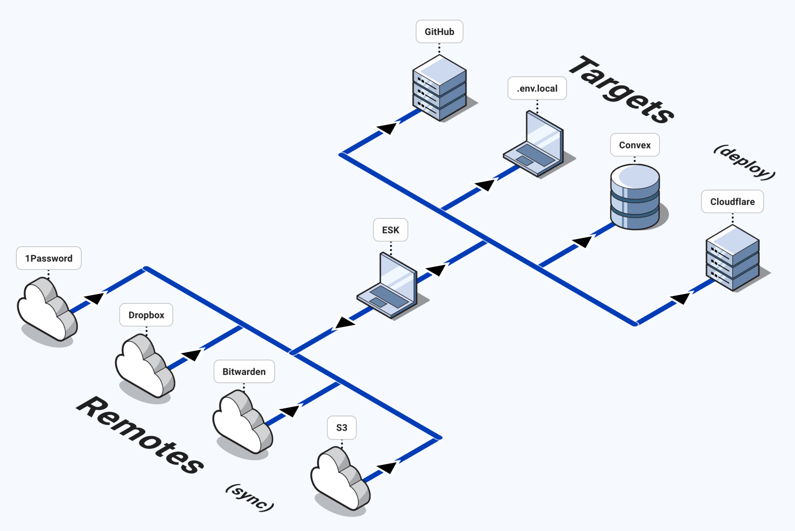

```
▄▖          ▗    ▌  ▄▖        ▗     ▖▖
▙▖▛▌▛▘▛▘▌▌▛▌▜▘█▌▛▌  ▚ █▌▛▘▛▘█▌▜▘▛▘  ▙▘█▌█▌▛▌█▌▛▘
▙▖▌▌▙▖▌ ▙▌▙▌▐▖▙▖▙▌  ▄▌▙▖▙▖▌ ▙▖▐▖▄▌  ▌▌▙▖▙▖▙▌▙▖▌
        ▄▌▌                               ▌
```

<div align="center">
  
</div>

**`ESK`** is an encrypted secrets manager that lets you define secrets once and deploy them to many targets.

Its differentiator is fan-out from one Git-versioned source of truth: define a secret once and deploy it everywhere it is needed. For targets esk writes itself, such as generated `.env` files, it reads the artifact back and repairs it when it no longer matches the store. For targets it cannot read back — most platform CLIs accept secrets without ever returning them — esk reports what it last sent rather than claiming to know the target's current state.

It is built for builders shipping one application to multiple environments and platforms:

- A local encrypted source of truth
- Simple deploys to local files and cloud platforms
- Optional sync/backup with shared secret backends

## What esk does

- Stores secrets in `.esk/store.enc` (versioned AES-256-GCM with authenticated format metadata)
- Obtains the decryption key from the configured local file or OS keychain; `ESK_STORE_KEY` supports CI and other headless runs
- Deploys to targets like `.env` files, Cloudflare, Convex, Vercel, GitHub Actions, Kubernetes, Docker Swarm, and more
- Syncs with remotes like 1Password, cloud folders, AWS Secrets Manager, Vault, Bitwarden, S3, GCP, Azure, Doppler, and SOPS
- Validates values against format, pattern, enum, and range constraints
- Audits required secrets before deploy — catches missing values early
- Detects empty/whitespace-only values that break runtime defaults
- Generates TypeScript declarations, runtime validators, Zod schemas, and `.env.example` templates
- Prunes orphaned deploys (secrets removed from config but still deployed to targets)

## Scope and non-goals

esk has no hosted dashboard, account system, or control plane. Local store access and
decryption do not depend on an esk service. Deploying to a cloud target still requires
network access to that target and may require its CLI or API credentials.

esk is designed for solo developers and small product teams. It does not provide
per-user access control, user-attributed audit logs, or a live credential-rotation
service; teams needing those controls should evaluate a service or KMS-backed tool.

## Install

**Shell script (Linux/macOS)**

```bash
curl -fsSL https://raw.githubusercontent.com/thomastheyoung/esk/main/install.sh | bash
```

**Cargo**

```bash
cargo install esk
cargo binstall esk
```

**From source**

```bash
git clone https://github.com/thomastheyoung/esk.git
cd esk
cargo build --release
```

## 60-second quick start

1. Initialize a project.

```bash
esk init
```

2. Add your first secret.

```bash
esk set API_KEY --env dev --group General
```

3. Add more secrets without syncing or deploying on each write, then deploy once.

```bash
esk set DATABASE_URL --env dev --group General --no-sync
esk deploy --env dev
```

4. Verify status.

```bash
esk list --env dev
esk status --env dev
```

`esk init` creates:

| File                     | Purpose                                                                  | Commit to git   |
| ------------------------ | ------------------------------------------------------------------------ | --------------- |
| `esk.yaml`               | Project config (environments, apps, targets, remotes, secrets, generate) | Yes             |
| `.esk/store.enc`         | Encrypted secret store                                                   | Yes             |
| `.esk/store.key`         | Local encryption key (32-byte hex); or stored in OS keychain             | No              |
| `.esk/store.version`     | Local rollback-detection high-water mark                                | No              |
| `.esk/key-provider`      | Records key storage method (`file` or `keychain`)                        | No (gitignored) |
| `.esk/deploy-index.json` | Deploy state tracker                                                     | No (gitignored) |
| `.esk/sync-index.json`   | Sync state tracker                                                       | No (gitignored) |

For local development, inject the selected environment directly into a child
process without writing a dotenv file:

```bash
esk run --env dev -- npm start
esk run --env dev --app web -- npm run dev
```

Only secrets targeted to the selected environment (and app, when supplied) are
injected. The child process can still expose its environment to descendants,
so use this for trusted local commands.

If the local encryption key may have been exposed, run `esk key rotate` from
the project root. It generates a new key, re-encrypts the store, and updates
the configured file or OS-keychain provider; distribute the new key to trusted
team members through the normal out-of-band process.

## Mental model

`esk` has 3 parts:

1. **Store**: local encrypted data (`.esk/store.enc` + local key)
2. **Targets**: deploy secrets to runtime services (`esk deploy`)
3. **Remotes**: sync full secret state to team/shared backends (`esk sync`)

## Important default behavior

By default, `esk set` and `esk delete` do more than update local storage:

1. Update encrypted local store
2. Push to configured remotes
3. Deploy to configured targets

Use `--no-sync` to skip steps 2 and 3. Use `--strict` to fail before deploy if any remote push fails.

## Minimal config (`esk.yaml`)

Start with local `.env` deploy only:

```yaml
project: myapp

environments: [dev, prod]

apps:
  web:
    path: .

targets:
  .env:
    pattern: "{app_path}/.env{env_suffix}.local"
    env_suffix:
      dev: ""
      prod: ".production"

secrets:
  General:
    API_KEY:
      description: Example API key
      targets:
        .env: [web:dev, web:prod]
```

When you need cloud deploy targets or shared sync, add target/remote blocks. See [TARGETS.md](TARGETS.md) and [REMOTES.md](REMOTES.md), or browse the [full example config](docs/esk.example.yaml) showcasing every available option.

## Commands you will use most

| Command                        | Purpose                                       |
| ------------------------------ | --------------------------------------------- |
| `esk init`                     | Initialize config and encrypted store         |
| `esk set <KEY> --env <ENV>`    | Set a secret (auto-sync/deploy by default)    |
| `esk get <KEY> --env <ENV>`    | Read a secret                                 |
| `esk delete <KEY> --env <ENV>` | Delete a secret (auto-sync/deploy by default) |
| `esk list [--env <ENV>]`       | List secrets and deploy status                |
| `esk deploy [--env <ENV>]`     | Deploy to configured targets                  |
| `esk status [--env <ENV>]`     | Show deploy and sync dashboard                |
| `esk verify [--env <ENV>]`     | Read back what targets hold and compare       |
| `esk sync [--env <ENV>]`       | Pull, reconcile, and push remote state        |
| `esk diff <ENV> <ENV>`         | Compare two environments                      |
| `esk run --env <ENV> -- <CMD>` | Run a command with secrets injected           |
| `esk import <FILE> --env <ENV>`| Load a dotenv file (no sync or deploy)        |
| `esk generate [<FORMAT>]`      | Generate code/config from secret definitions  |
| `esk doctor`                   | Diagnose project health in one pass           |
| `esk key rotate`               | Re-encrypt the store under a new key          |

Full flags and behavior: [API.md](API.md).

### Deployed vs. verified

`esk deploy` and `esk status` report from `.esk/deploy-index.json`, which records what esk *sent*. They cannot detect a secret changed or deleted outside esk — through a provider dashboard, a teammate's CLI, or another tool.

`esk verify` is the only command that asks the targets themselves. Run it when you need to trust the state rather than the record:

```bash
esk verify --env prod
```

What each target can prove is a permanent property of its provider's API, not a roadmap item: some return stored values, some list key names only, and a few cannot be read back at all. Targets that cannot be verified are reported as explicit gaps — never as passing. See the verification column in [TARGETS.md](TARGETS.md).

## Supported deploy targets

- `.env* files`
- `aws_lambda`
- `aws_ssm`
- `azure_app_service`
- `circleci`
- `cloudflare`
- `convex`
- `docker`
- `fly`
- `gcp_cloud_run`
- `github`
- `gitlab`
- `heroku`
- `kubernetes`
- `netlify`
- `railway`
- `render`
- `supabase`
- `vercel`
- [Custom targets](TARGETS.md#custom) — define your own deploy commands in `esk.yaml`

Target config details: [TARGETS.md](TARGETS.md).

## Supported sync remotes

- `1password`
- `aws_secrets_manager`
- `azure`
- `bitwarden`
- Cloud storage (`dropbox`, `gdrive`, `onedrive`, etc.)
- `doppler`
- `gcp`
- `infisical`
- `s3`
- `sops`
- `vault`

Remote config details: [REMOTES.md](REMOTES.md).

## Security model

- Encryption: AES-256-GCM with a random nonce for every write
- Key isolation: `.esk/store.key` stays local and must not be committed
- Rollback detection: when the local `.esk/store.version` marker is present, it records a version high-water mark and rejects restoring an older committed `store.enc`
- Tamper resistance: authenticated encryption
- Reliability: atomic writes for store and index files

The encrypted store file is safe to commit. The key file is not.

### Memory handling

The store zeroizes selected transient key, serialization, and deploy buffers.
Secret payloads and target interfaces still use ordinary `String` values in
several paths, so this is defense in depth rather than a guarantee that no
plaintext copy can remain in process memory. Treat host memory and crash dumps
as part of the threat model; do not run esk on an untrusted host.

### Key storage

The encryption key can be stored in three ways:

| Provider | How | When to use |
|----------|-----|-------------|
| File (default) | `.esk/store.key`, gitignored | Works everywhere, including CI and headless |
| OS keychain | macOS Keychain, Windows Credential Manager, Linux Secret Service | Interactive workstations using the native OS credential store |
| Environment | `ESK_STORE_KEY` (32-byte hex) | CI and other headless, ephemeral environments |

Initialize with `esk init` (file) or `esk init --keychain` (keychain). On supported platforms (macOS, Windows, Linux with Secret Service), `esk init` will prompt to choose.

**Why not 1Password, Bitwarden, or other password managers?** The encryption key is read on every `esk` command. It must be local, instant, and available offline. Password managers require network access and interactive auth, making them unsuitable as a key provider. They also create a circular dependency: esk uses these services as sync remotes for the encrypted store, so the key that decrypts the store cannot itself depend on reaching those services.

For small-team key distribution, share the key out-of-band through a secure channel. The encrypted store is then shared via remotes as usual.

#### CI and headless environments

Set `ESK_STORE_KEY` to the same 64-character hexadecimal key normally stored in
`.esk/store.key`. It takes precedence over the configured file or OS-keychain
provider, is never written to disk by esk, and works with every command that
opens the encrypted store.

```yaml
# GitHub Actions
env:
  ESK_STORE_KEY: ${{ secrets.ESK_STORE_KEY }}
```

The variable must contain exactly 32 bytes encoded as hexadecimal. Keep it in
the CI provider's masked secret store; environment variables can be exposed by
debug logging, child processes, or compromised runners. `esk init` continues to
honor its explicit file/keychain choice, and `esk key rotate` must be run with
the environment variable unset so the new key can be persisted.

## Quick troubleshooting

- `esk.yaml not found`: run commands from your project root, or run `esk init`
- `encryption key not found`: run `esk init` to create `.esk/store.key`, or `esk init --keychain` for OS keychain
- Target/remote CLI errors: install and authenticate required CLIs (for example `wrangler`, `op`, `aws`)
- Unknown environment/app in target: verify names match `environments` and `apps` in `esk.yaml`

## MCP server

esk includes an MCP (Model Context Protocol) server that exposes secret operations as structured tools over stdio. Any MCP-compatible client can use it — Claude Code, Claude Desktop, Cursor, Zed, etc.

**Build:**

```bash
cargo install esk --features mcp
# or from source
cargo build --release --features mcp
```

**Configure** (example for Claude Code `~/.claude/settings.json`):

```json
{
  "mcpServers": {
    "esk": {
      "command": "esk-mcp",
      "args": []
    }
  }
}
```

**Available tools:**

| Tool           | Description                                      |
| -------------- | ------------------------------------------------ |
| `esk_get`      | Retrieve a secret value                          |
| `esk_set`      | Set a secret value (no auto-deploy)              |
| `esk_delete`   | Delete a secret value (no auto-deploy)           |
| `esk_list`     | List secrets with deploy status per environment  |
| `esk_status`   | Project health: pending work, warnings, next steps |
| `esk_deploy`   | Deploy secrets to configured targets             |
| `esk_generate` | Generate TypeScript declarations, Zod schemas, `.env.example` |

The MCP binary is feature-gated behind `mcp` to keep the main CLI binary lean.

### MCP security policy

MCP values are redacted by default. To permit a client to read plaintext values,
add `mcp.expose_values: true` to `esk.yaml`. You can restrict the server to an
environment allowlist and disable all mutating tools:

```yaml
mcp:
  expose_values: false
  envs: [dev]
  read_only: true
```

An environment allowlist requires `esk_status` and `esk_deploy` to name an
allowed environment explicitly. Treat MCP clients as automation with access to
the project: prompt injection can cause a connected client to request tools,
so keep plaintext access disabled and use `read_only` unless writes are needed.

## Development

`cargo xtask sandbox` builds a release binary and scaffolds a test project in `/private/tmp/esk-test` with mock CLI shims and sample secrets.

```bash
cargo xtask sandbox
cargo xtask sandbox --clean
```

Release from `Cargo.toml` version in one command:

```bash
cargo release-tag
```

This command:

- verifies you are on `main` and your working tree is clean
- reads the crate version and checks the tag doesn't already exist
- pulls with rebase from origin
- runs `fmt --check`, `clippy`, and `test`
- pushes `main`, then creates and pushes the `v<version>` tag

Preview without changes:

```bash
cargo xtask release --dry-run
```

## License

[PolyForm Shield 1.0.0](LICENSE)
